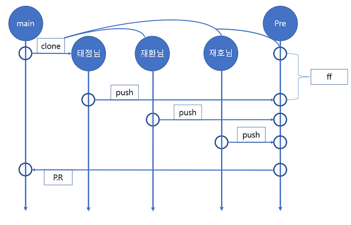

# 프로젝트에서 해야 할 일

- 이번 프로젝트는 WEB-SKILLS/src/data 안에 있는 .js파일을 열어 'text' 부분을 번역하는 것을 목표로 합니다.

# 업무 분배

- index.html을 실행하여 "1부터4번"은 제가 하며 "5부터8번"은 "재환"님이, "9~12번"은 "재호"님이 번역합니다.

- 태정님 : fundamentals.js, accessibility.js, web-components.js, pwa.js
- 재환님 : build-tools.js, frameworks-and-libraries.js, testing.js, architecture-and-paradigmes.js
- 재호님 : team-collaboration.js, design-and-ux.js, modern.js, algorithms.js

# 업무 순서

1. 본인 web-skilss 파일 위치로 이동한다.

2. `git pull origin main`으로 원격 저장소의 main을 가져온다.

3. `git branch 본인이름` 본인 이름(성 제외) 영어로 브랜치를 생성한다

4. `git checkout 본인이름`으로 본인 브랜치로 이동

5. ./src/data/수정 할 파일 으로 이동 후 'name', 'text'에 해당하는 부분 번역(파파고 사용)후 저장

6. `git add ./src/data/수정파일이름.js`로 스테이징 영역으로 이동

7. `git commit -m "커밋내용입력"` 커밋 입력

8. 본인 브랜치 확인 후 본은 브랜츠로 `push` 함

8. 'github'홈에서 본인 브랜치를 'pre' 브랜치로 `pull request`

9. 정상 작동 확인 후 스스로 'pre'에 `merge`

10. 'pre'에 `merge`했다면, 'main'에 `pull request`

11. 매일 8시에 `pull request` 승인하겠으며, 톡방에 요청 올리면 수시로 승인하겠음

12. `pull request`가 완료되면 본인이 생성한 이슈는 본인이 'close'

# git flow 전략

- 로컬에 개인 브랜치를 생성해 개인 커밋을 온라인 개인 브랜치 업로드 합니다.(정상 작동 확인 필수)

- 개인 커밋을 'pre'브랜치에 `push` 하고 작동을 확인합니다. 정상 작동하면 'pre'에서 `merge` 합니다.

- `merge` 이후에 정상 작동한다면, 'main'브랜치에 `pull request` 하고, 에러가나면 `git reset`후 수정 합니다.

- 최종 권한자가 'main' 브랜치의 `pull request`승인 권한을 갖고, 정해진 시간에 승인합니다.

# 'issue' and 'pull request' rule

- 이슈 생성 시 '1fundamental_HTML'처럼 생성할 것

- 'main' 브랜치에 `merge` 된 후 관련 본인이 생성한 이슈는 스스로 닫아줄 것

- 풀 리퀘스트 시 '1fundamental_HTML번역완료(#이슈번호)' 작성하고 설명에 어디를 수정했다고 명시할 것

- 풀 리퀘스트 설명에 vscode에서 `컨트롤 + f` 로 남이 찾아볼 수 있게 or vscode에서 왼쪽 줄 번호 명시 할 것(ex.122 ~ 140)

- 풀 리퀘스트 거절 사유 발생 시 제목은 위와 동일하게 작성하고 마지막에 'reject'추가 ex) '1fundamental_HTML(reject)'

# 그 외의 정보들

- '2022-10-11' [실습](https://violet-bora-lee.github.io/git-tutorial/#commit)

- '2022-10-18' [브랜치 실습 링크](https://learngitbranching.js.org/?locale=ko)

- `git rebase --interactive` [사용 방법](https://wormwlrm.github.io/2020/09/03/Git-rebase-with-interactive-option.html)
